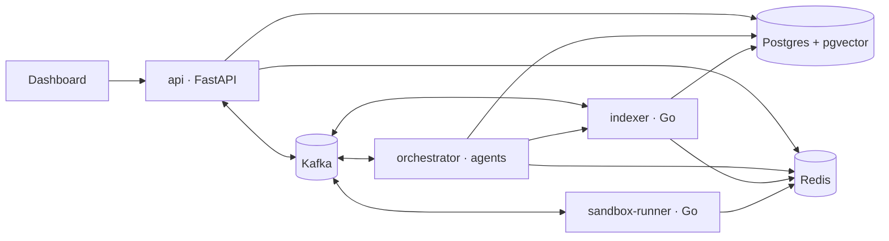

# DevAssist

DevAssist is a multi-agent AI platform that takes a plain-English change request for a GitHub repository, plans it, writes the code and tests, and validates every patch in a locked-down Docker sandbox. Validated patches land in a review dashboard where a human reads the diff, the agents' reasoning, and the test/security/lint results, and approves it straight into a pull request.

> **Status:** Phases 1-5 of 7 complete (foundation, indexer, sandbox runner, agents, API + GitHub). See [Roadmap](#roadmap).

## Architecture

Python (FastAPI) for the API and agent orchestration, Go for the
performance-sensitive indexer and sandbox runner, Postgres + pgvector for data
and embeddings, Redis for caching and locks, and Kafka as the event bus.
Details: [docs/architecture.md](docs/architecture.md).



## Quickstart

Requirements: Docker with Compose v2, and `make`.

```bash
git clone https://github.com/Shaj2x/devassist.git
cd devassist
make up      # builds every image, starts the stack, waits until all services are healthy
make smoke   # hits every service's /readyz
```

| URL                              | What                           |
| -------------------------------- | ------------------------------ |
| http://localhost:3000            | Dashboard                      |
| http://localhost:8000/docs       | API (OpenAPI / Swagger UI)     |
| http://localhost:8001/readyz     | Orchestrator readiness         |
| http://localhost:8080/readyz     | Indexer readiness              |
| http://localhost:8081/readyz     | Sandbox runner readiness       |

`make up` creates `.env` from [`.env.example`](.env.example) on first run and
builds the sandbox images (the first build takes a few minutes; the Go image
is the largest). No
API keys are needed for the foundation; the LLM and embedding providers
default to offline mocks.

### Try the indexer

`make up` also publishes the demo repos in `sample-repos/` as local git
remotes. Index one and search it:

```bash
make demo-index                                  # clone, chunk, embed, store
make demo-search q="parse a duration like 1h30m"
```

```
1. datekit/parsing.py:20-27  [function parse_duration]  score=0.331
     def parse_duration(text: str) -> timedelta:
         """Parse compact durations like ``1h30m``, ``2d``, or ``45s``."""
```

How chunking, incremental reindexing and caching work:
[docs/indexer.md](docs/indexer.md).

### Try the sandbox

Validate hand-written patches against the same sample repo. Each runs in a
fresh locked-down container (no network, read-only root, non-root, resource
and time limits) that is removed afterwards:

```bash
make demo-validate patch=datekit-fix-leap-year     # PASSED: 14 tests
make demo-validate patch=datekit-broken-fix        # FAILED: 3 failing tests
make demo-validate patch=datekit-insecure-helper   # FAILED: bandit B602 + ruff F821
```

```
status: FAILED  (1.1s)
  tests     passed   14 passed, 0 failed, 0 skipped
  security  failed   bandit: 2 finding(s), 1 blocking
      - B602 datekit/calendar.py:15 subprocess call with shell=True identified, security issue.
  static    failed   ruff: 1 finding(s), 1 blocking
      - F821 datekit/calendar.py:19 Undefined name `is_valid`
```

How isolation works, and the tests that try to break it:
[docs/sandbox.md](docs/sandbox.md).

### Run the agents

Five agents plan, code, test, debug and review a change, validating every
patch in the sandbox. Without an API key the scripted mock LLM is used, and
its Coder deliberately gets the first attempt wrong so you see the debug loop:

```bash
make demo-run
```

```
 #  iter  agent     status     in_tok out_tok    cost $     ms
 1     1  planner   succeeded     572     212    0.0000      5
 2     1  coder     succeeded    1317     269    0.0000      5
 3     1  tester    succeeded    1103     340    0.0000      5
 4     2  debugger  succeeded    1865     351    0.0000      5
 5     2  reviewer  succeeded     695     150    0.0000      5

patches:
  iteration 1: superseded +14/-1 in 2 file(s)  [tests=failed security=passed static=passed]
  iteration 2: passed     +14/-1 in 2 file(s)  [tests=passed security=passed static=passed]

result: AWAITING_REVIEW after 2 iteration(s)
```

Set `LLM_PROVIDER=anthropic` and `ANTHROPIC_API_KEY` (or `openai` and
`OPENAI_API_KEY`) in `.env` to run real models. How the loop works and why it
cannot run forever: [docs/agents.md](docs/agents.md).

### Drive it through the API

The same flow, event-driven, the way the dashboard uses it: register the
repo (the indexer picks it up from Kafka), submit a task (the orchestrator
picks it up, and every patch goes to the sandbox runner and back over
Kafka), then approve:

```bash
make demo-api
```

```
==> waiting for the indexer (repo.registered -> repo.indexed)
==> submitting: Fix the failing test in datekit/calendar.py
    queued
    validating
    awaiting_review
  patch 1: superseded tests=failed security=passed static=passed
  patch 2: passed     tests=passed security=passed static=passed
  review (low risk): Fixes is_leap_year to follow the Gregorian calendar ...
Approve:  curl -X POST http://localhost:8000/v1/jobs/<id>/approve
```

For a real GitHub repository, put a fine-grained token with Contents and
Pull requests write access in `GITHUB_TOKEN`, register it with
`POST /v1/repos {"full_name": "owner/name"}`, and approving opens a pull
request. Endpoints, auth modes and delivery guarantees:
[docs/api.md](docs/api.md).

Building behind a TLS-inspecting corporate proxy? See
[deploy/certs/README.md](deploy/certs/README.md).

## Development

For local tooling you need [uv](https://docs.astral.sh/uv/), Go 1.24+, Node 22+
and golangci-lint v2.

```bash
make install           # uv sync, go mod download, npm ci
make test              # unit tests: Python, Go, dashboard
make lint              # ruff + mypy --strict, gofmt + go vet + golangci-lint, eslint + tsc
make test-integration  # migrations, indexing, sandbox escapes, full agent pipeline (needs `make up`)
make logs s=api        # follow one service's JSON logs
make down              # stop (keeps data);  make clean  # stop and wipe volumes
```

## Repository layout

```
libs/devassist-common/  shared Python: config, JSON logging, events, DB models, health checks
libs/gocommon/          shared Go: the same, for the Go services
services/api/           FastAPI service + Alembic migrations (owns the schema)
services/orchestrator/  multi-agent workflow: providers, agents, state machine
services/indexer/       Go: clone, chunk, embed, semantic search
services/sandbox-runner/ Go: isolated patch validation
dashboard/              React + TypeScript + Vite review UI
proto/events/           JSON Schemas for every Kafka event + shared fixtures
sample-repos/           small demo repositories DevAssist works on
demo/patches/           hand-written patches for the sandbox demo
deploy/                 docker-compose, Kafka topic setup, k8s (Phase 7)
docs/                   architecture and design notes
```

## Roadmap

- [x] **Phase 1: Foundation.** Monorepo, docker-compose (Postgres/pgvector,
  Redis, Kafka in KRaft mode), service skeletons with health checks, full
  schema migration, event contracts, Makefile.
- [x] **Phase 2: Indexer.** Clone, tree-sitter chunking, pluggable embeddings
  with incremental reuse, pgvector search, symbol lookup, Kafka consumer with
  retries and dead-lettering, Redis locks and caching.
- [x] **Phase 3: Sandbox runner.** Hardened disposable containers running
  tests, security scans and static analysis for Python, Go and JS/TS, with
  escape-attempt integration tests and guaranteed teardown.
- [x] **Phase 4: Agents.** Planner, Coder, Tester, Debugger and Reviewer on
  a hand-written state machine, with Anthropic/OpenAI/mock providers, full
  step persistence, cost budgets and stuck detection.
- [x] **Phase 5: API + GitHub.** REST API with dev and GitHub-token auth,
  Kafka wiring end to end (DLQs, idempotent consumers), live progress over
  SSE, approve / reject / request-changes, PRs via the Git Data API.
- [ ] **Phase 6: Dashboard.** Live job timeline, diff viewer, validation results, approve flow.
- [ ] **Phase 7: Deployment + polish.** Kubernetes, CI, metrics, full docs.
