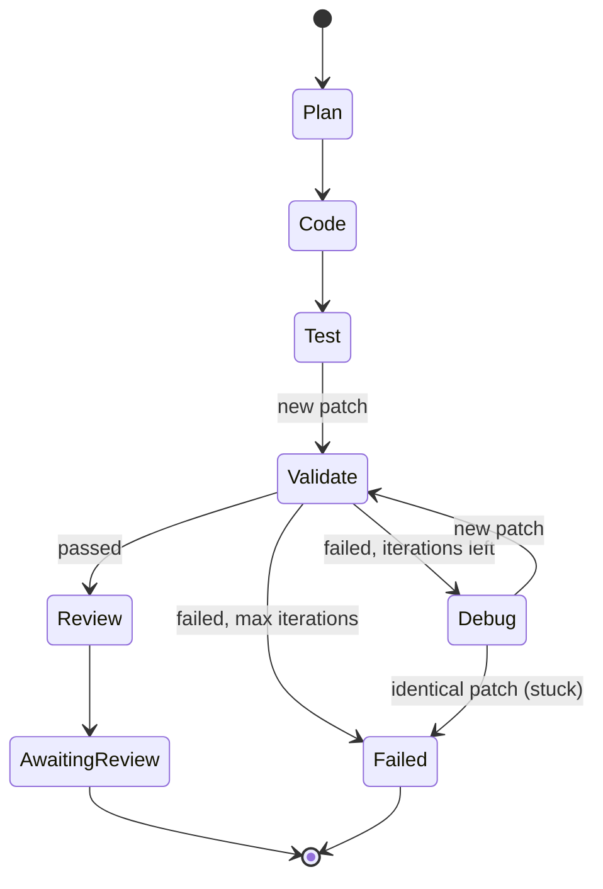

# Agents and the loop

The orchestrator turns a change request into a validated patch with five
agents and a small, explicit state machine. There is no agent framework
underneath: `agents/base.py` (about 100 lines) and `workflow.py` are the
whole thing.



## The agents

| Agent    | Sees                                                                    | Returns |
| -------- | ----------------------------------------------------------------------- | ------- |
| Planner  | task, file tree, semantic search results for the task                   | files to change, steps, risks, test strategy, search queries |
| Coder    | task, plan, full text of the planned files, search results for the plan's queries | whole-file edits |
| Tester   | task, test strategy, the patch, the related existing test files         | whole-file edits to test files only |
| Debugger | task, plan, current patch, validation report (failing tests, findings, log tail), the changed and failing files, earlier attempts | diagnosis + whole-file edits |
| Reviewer | task, plan, final patch, validation results                             | summary, risk level, concerns, follow-ups |

Each agent is data: a system prompt, a function that renders its user prompt
from the job context, an output Pydantic model, and an effort level. The
output model doubles as the JSON schema the provider enforces (structured
outputs on both Anthropic and OpenAI). If a response still fails validation,
the agent shows the model its answer and the error and asks once more.

### Retrieval, not repo stuffing

Agents never get the whole repository. The Planner sees the file tree and the
indexer's top hits for the task; it names the files to change and proposes
search queries; the Coder gets those files in full plus the hits for those
queries. Retrieval is code-controlled (the orchestrator runs the searches)
rather than a tool the model calls in a loop: it is cheaper, deterministic,
and easy to test, at the cost of the model not being able to ask follow-up
questions. Moving to model-driven tool use later is a local change in
`workflow.py`.

### Whole-file edits, not model-written diffs

The Coder, Tester and Debugger return the full new content of each file they
change. The orchestrator writes the files into a real git checkout and asks
git for the unified diff. Model-written diffs fail to apply on a single
miscounted hunk header; this approach cannot produce a malformed patch, and
the diff the human reviews is exactly what git produced.

## How the loop avoids running forever

1. **Iteration cap.** At most `MAX_ITERATIONS` patches are validated per job
   (default 3). Validation failing on the last one ends the job as `failed`.
2. **Stuck detection.** Every patch is fingerprinted. A debugger "fix" that
   reproduces an earlier patch ends the job immediately instead of paying
   for another identical sandbox run.
3. **Cost budget.** Before every LLM call the agent checks the job's running
   cost against `JOB_BUDGET_USD`.
4. **Bounded calls.** Every LLM call has a per-attempt timeout
   (`LLM_TIMEOUT_SECONDS`) and a bounded retry count (`LLM_MAX_RETRIES`, the
   SDKs' exponential backoff on 429/5xx/connection errors), plus one repair
   attempt for invalid JSON.
5. **One worker per job.** A Redis lock (renewed while the job runs) stops
   two workers from executing the same job.

## Providers

`LLM_PROVIDER` selects `anthropic`, `openai` or `mock`. All three implement
one `complete(LLMRequest) -> LLMResponse` method; agents never import an SDK.

- **Anthropic** (default model `claude-opus-5-5`): streaming request,
  `output_config.format` for structured JSON, per-agent `effort`, the system
  prompt marked for prompt caching, and server-side refusal fallbacks
  (`fallbacks: "default"`) so a safety refusal is retried on a fallback model
  the API picks; a refusal that survives raises `LLMRefusal`.
- **OpenAI** (default `gpt-5`): chat completions with a strict
  `json_schema` response format; cached prompt tokens are split out for
  pricing.
- **Mock**: replays a JSON script of agent responses. The bundled
  `datekit_fix_leap_year` script makes the Coder get it wrong first, so a
  demo exercises the debug loop.

Every call's tokens (input, output, cache reads and writes) are priced from
`llm/pricing.py` and stored on the agent step; job totals are kept in the
same transaction.

## What gets persisted

| Table             | Written when                                    |
| ----------------- | ----------------------------------------------- |
| `agent_steps`     | every LLM call: prompt, response, parsed output, tokens, cost, latency, error |
| `jobs`            | status changes, plan, review, running totals    |
| `patches`         | every new patch (earlier failing ones become `superseded`) |
| `validation_runs` | every sandbox result, split into tests / security / static |

Live progress also goes to Redis (`devassist:job:<id>:progress`, plus a
pub/sub channel) for the dashboard.

## Try it

```bash
make demo-run                    # mock LLM, no API key needed
make demo-run args=--show-diff   # also print the final patch
```

With a key in `.env` (`LLM_PROVIDER=anthropic`, `ANTHROPIC_API_KEY=...`), the
same command runs real models.
