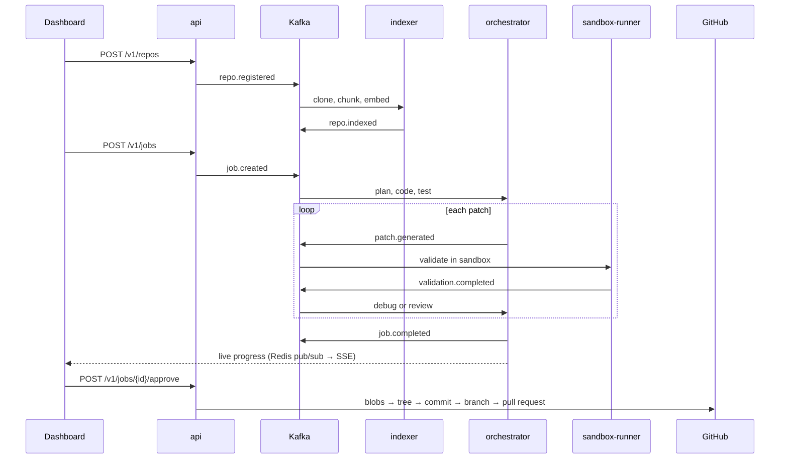

# API, events and GitHub

The `api` service is the only thing the dashboard talks to. It owns users,
repositories, job creation and the review decision. Everything slow happens
in other services and is driven by Kafka events.



## Endpoints

Full schemas are at <http://localhost:8000/docs>.

| Method | Path | What |
| --- | --- | --- |
| `POST` | `/v1/auth/token` | Exchange a GitHub token for a session (token mode) |
| `GET` | `/v1/auth/me` | Current user, auth mode, whether GitHub is connected |
| `POST` | `/v1/auth/logout` | End the session |
| `POST` | `/v1/repos` | Register `owner/name` on GitHub (or a `clone_url` in dev) and index it |
| `GET` | `/v1/repos` | Your repositories with their latest index snapshot |
| `GET` | `/v1/repos/{id}` | One repository |
| `POST` | `/v1/repos/{id}/reindex` | Index the default branch again |
| `DELETE` | `/v1/repos/{id}` | Remove it, its index and its jobs |
| `POST` | `/v1/jobs` | Submit a task (`202`; 409 until the repo is indexed) |
| `GET` | `/v1/jobs` | Jobs, newest first (`repo_id`, `status`, `limit`, `offset`) |
| `GET` | `/v1/jobs/{id}` | Plan, agent steps, patches with validations, review, PR, live progress |
| `GET` | `/v1/jobs/{id}/steps/{step}` | One agent call: full prompt, raw response, parsed output |
| `GET` | `/v1/jobs/{id}/events` | Server-sent events: `progress` on every change, `end` when settled |
| `GET` | `/v1/events` | Server-sent `notification`s: repo indexed, job finished |
| `POST` | `/v1/jobs/{id}/approve` | Open the pull request (local repos: just mark approved) |
| `POST` | `/v1/jobs/{id}/reject` | Reject, with an optional reason |
| `POST` | `/v1/jobs/{id}/request-changes` | Send it back to the agents with feedback |

### Job states

```
queued → planning → coding → testing → validating ⇄ debugging → reviewing → awaiting_review
                                                                                  │
                     changes_requested ←─── request-changes ──────────────────────┤
                     (agents run again)                                           ├─ approve → approved / pr_opened
                                                                                  └─ reject  → rejected
any running state → failed   (budget, iteration limit, stuck, provider error)
```

Review actions are compare-and-set updates on the job's status, so two
reviewers clicking at once cannot both approve, and approving a job that is
still running is a `409`.

**Request changes** keeps the history: patch numbering continues where it
stopped, and the feedback is appended to the task the Planner, Coder and
Debugger see. The iteration budget applies again to the new round.

## Authentication

Two modes, set with `AUTH_MODE`:

- **`dev`** (default): no sign-in. Every request is the local `demo` user,
  GitHub calls use `GITHUB_TOKEN` from `.env`, and local `file://` repos
  (the bundled samples) can be registered. For your own machine only.
- **`token`**: users sign in with their own GitHub personal access token.
  The API checks it against GitHub, stores it encrypted with
  `TOKEN_ENCRYPTION_KEY` (Fernet), and returns a random session token. Only
  the session token's SHA-256 is kept (in Redis, with a TTL), so a Redis
  dump yields no usable sessions. Send it as `Authorization: Bearer ...`
  (`?access_token=` for EventSource, which cannot set headers). Local repos
  are refused unless `ALLOW_LOCAL_REPOS=true`.

Every repository and job query is scoped to the caller, so another user's
ids return `404`.

## Opening the pull request

The orchestrator stores the final content of every changed file on the
patch (`patches.files`), so the API needs no clone and no git binary. On
approve it uses GitHub's Git Data API:

1. read the commit the agents worked from (`jobs.base_commit_sha`, pinned to
   the indexed snapshot when the job was created);
2. upload each changed file as a blob, and build a tree on top of the base
   tree (deleted files are tree entries with a null sha);
3. create a commit whose parent is that base commit, and a branch
   `devassist/job-<id>-v<iteration>` pointing at it;
4. open the PR against the default branch, with the plan, the Reviewer's
   summary, risk and concerns, and the sandbox results in the description.

Because the parent is the validated base commit, the PR shows exactly the
change that passed the sandbox even if the default branch has moved on;
GitHub reports any conflicts. If any GitHub call fails, the job goes back to
`awaiting_review` with the error recorded, so the reviewer can retry.

The token needs **Contents: write** and **Pull requests: write** on the
repository (fine-grained PAT).

## Events and delivery guarantees

Topics are named after event types (`repo.registered`, `repo.indexed`,
`job.created`, `patch.generated`, `validation.completed`, `job.completed`),
keyed by trace id (the job or repo id) so one job's events stay ordered.
Schemas: [`proto/events`](../proto/events).

- **At-least-once.** Consumers commit offsets only after the handler
  succeeded or the message was dead-lettered.
- **Retries, then a dead-letter topic.** Failures retry with exponential
  backoff; bad payloads and exhausted retries go to `<topic>.dlq` with the
  error, attempt count and original offset in headers.
- **Idempotent handlers.** The indexer and the API's `job.completed`
  handler record `(consumer, event_id)` in `processed_events` in the same
  transaction as their writes. The orchestrator skips a `job.created` whose
  job is already settled and holds a Redis lock per job, so a redelivered
  event can never run the same job twice at once.
- **Validation round trip.** The orchestrator replica running a job
  publishes `patch.generated` and waits on a per-patch Redis list. Every
  replica consumes `validation.completed` (one consumer group per process)
  and pushes the result onto that list, so the waiting job need not be on
  the replica that happened to receive the event.

## Live progress

The orchestrator writes a small progress document to Redis on every change
(`devassist:job:<id>:progress`) and publishes it on
`devassist:job:<id>:events`. `GET /v1/jobs/{id}/events` subscribes first,
then sends the current snapshot, then relays each change, so a client that
connects mid-job misses nothing. Postgres stays the record; Redis is only
the live view.
