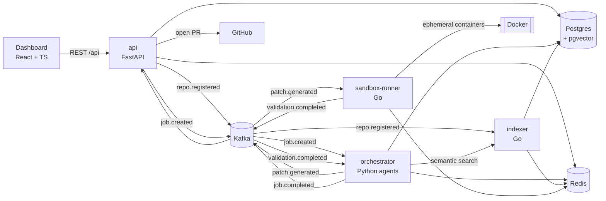
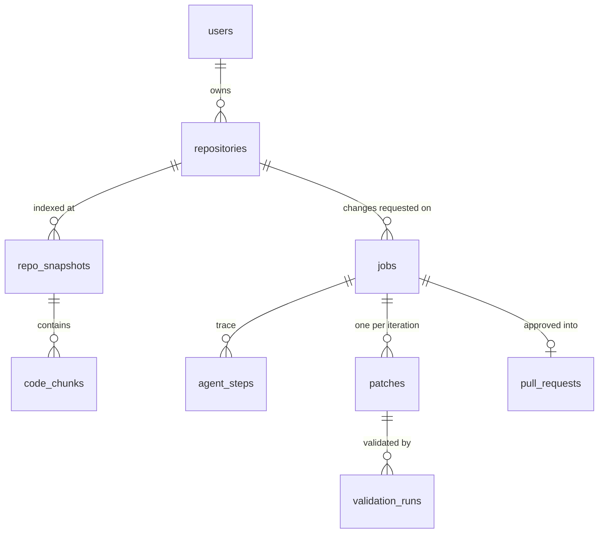

# Architecture

## Services

| Service          | Language | Owns                                                   | Talks to                     |
| ---------------- | -------- | ------------------------------------------------------ | ---------------------------- |
| `api`            | Python   | users, repositories, job creation, review, PRs         | Postgres, Redis, Kafka, GitHub |
| `orchestrator`   | Python   | agent loop, agent_steps, patches, validation_runs      | Postgres, Redis, Kafka, indexer, LLM |
| `indexer`        | Go       | repo_snapshots, code_chunks (embeddings), search       | Postgres, Redis, Kafka, LLM embeddings |
| `sandbox-runner` | Go       | nothing persistent: results travel as events           | Redis, Kafka, Docker         |
| `dashboard`      | TS       | UI only                                                | api (via `/api` proxy)       |

## Cross-cutting conventions

- **Config:** environment variables only; see `.env.example`.
- **Health:** every service serves `/healthz` (process alive) and `/readyz`
  (dependencies reachable, Kafka topics present).
- **Logs:** one JSON object per line with `time`, `level`, `service`, `msg`
  and, inside a job, `trace_id`. Filter on `trace_id` to follow one job across
  every service.
- **Events:** one envelope for every topic, defined in
  [`proto/events`](../proto/events/README.md). Both languages test against the
  same fixtures.
- **Schema:** owned by Alembic in `services/api/alembic`. The Go indexer
  writes to `repo_snapshots` and `code_chunks` but never migrates.

## Data model

Idempotency is enforced by the schema, not by hope:
`repo_snapshots(repo_id, commit_sha)`, `patches(job_id, iteration)`,
`agent_steps(job_id, sequence)`, `validation_runs(source_event_id)`, and the
`processed_events(consumer, event_id)` ledger are all unique.
