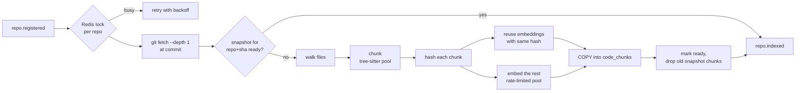

# Indexer

The indexer turns a repository commit into searchable chunks so the agents
can pull in relevant code instead of the whole repo.



## Chunking

| Language                    | Strategy                                                        |
| --------------------------- | --------------------------------------------------------------- |
| Python, Go, JS, TS, TSX     | tree-sitter: one chunk per top-level function, class, method or type. Large classes split into methods (`Class.method`), oversized definitions into overlapping windows. Code between definitions becomes `module` chunks. |
| Everything else indexed     | 60-line windows with 10 lines of overlap.                       |

Skipped: `.git`, `node_modules`, `vendor`, build output, hidden directories,
lockfiles, minified files, binaries, symlinks, and files over 256 KB.

## Incremental reindexing

Each chunk's **content hash** covers exactly what is embedded (file path,
symbol, code). On a new commit, the indexer looks up stored embeddings with
the same hash *and the same embedding model* and reuses them, so changing
one function re-embeds one chunk. The same commit twice is a no-op, since
snapshots are unique per `(repo, commit)`.

## Embedding providers

| `EMBEDDING_PROVIDER` | Model (default)                  | Notes                                     |
| -------------------- | -------------------------------- | ----------------------------------------- |
| `local`              | feature hashing, 1024-d          | No key, offline, lexical matching only    |
| `openai`             | `text-embedding-3-small` @ 1024  | `dimensions` parameter sized to the column |
| `voyage`             | `voyage-code-3` @ 1024           | Code-specialized; separate query/document modes |

Remote calls have a per-attempt timeout, retries with exponential backoff and
jitter on 429/5xx (honouring `Retry-After`), and a shared token-bucket rate
limiter across all embedding workers.

## API

```bash
# Semantic search
curl -s localhost:8080/v1/search -d '{"repo_id":"<id>","query":"leap year","top_k":5}'
# Symbol lookup (exact, then prefix, then Class.method)
curl -s "localhost:8080/v1/repos/<id>/symbols?name=parse"
# Index status
curl -s localhost:8080/v1/repos/<id>/index
```

Search results are cached in Redis under a key that includes the snapshot id,
so a reindex can never serve stale results. If Redis is down, search still
works, just uncached.

## Failure handling

| Failure                         | Behaviour                                           |
| ------------------------------- | --------------------------------------------------- |
| Another worker indexing the repo | `ErrBusy`, Kafka consumer retries with backoff      |
| Clone fails                     | Retried, then dead-lettered to `repo.registered.dlq` |
| Unknown repository / bad payload | Dead-lettered immediately (permanent error)        |
| Embedding fails mid-run         | Snapshot marked `failed`, `repo.indexed{status: failed}` published; a later retry reuses the same snapshot row |
| Duplicate event delivery        | Skipped via the `processed_events` ledger           |
