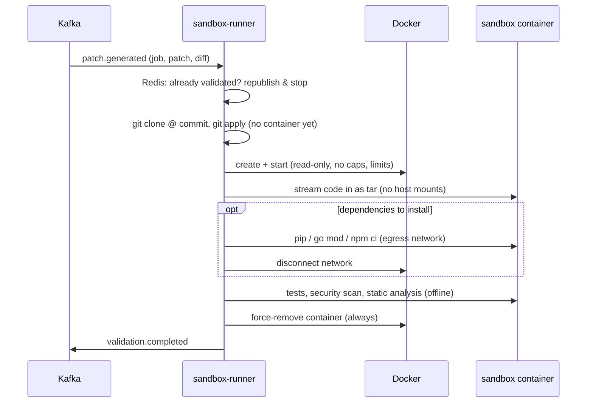

# Sandbox runner

The sandbox runner answers one question about every candidate patch: *does
it work, and is it safe to show a human?* It runs the repository's tests, a
security scan and static analysis on the patched code, inside a disposable
container that the code cannot escape or abuse.



## What runs

| Language | Tests            | Security                 | Static analysis              |
| -------- | ---------------- | ------------------------ | ---------------------------- |
| Python   | pytest (JUnit)   | bandit                   | ruff (`F`, `E9`, `B`)        |
| Go       | `go test -json`  | gosec                    | `go vet` + staticcheck       |
| JS / TS  | `npm test`       | `npm audit`              | eslint + `tsc --noEmit`, from the repo's devDependencies |

Language is detected from marker files (`go.mod`, `pyproject.toml`,
`setup.py`, `requirements.txt`, `package.json`). The install and test commands
and the language can be overridden per repository.

**What fails a patch**, decided in one place (`internal/parse`):

- tests: any failing or erroring test
- security: any **high** (or critical) severity finding
- static analysis: any error-level finding (undefined names, syntax errors,
  vet errors); style issues are reported as warnings only

Security and static findings are limited to **files the patch touches**. The
reviewer is judging this change, not the repository's existing debt; the
summary says how many findings elsewhere were left out.

A patch that does not apply, fails a check, or times out is a normal result,
not an error. The Debugger agent gets the failing test names, assertion
messages and tool findings, which is what it needs to produce a fix.

## Isolation

Every layer below is asserted in `internal/sandbox/spec_test.go`, and
`internal/validate/sandbox_integration_test.go` attacks a real sandbox:
it submits a patch whose tests each pass only if an escape works, and
requires all of them to fail.

| Layer          | Setting                                                     | Escape test that must fail          |
| -------------- | ----------------------------------------------------------- | ----------------------------------- |
| Network        | `--network none`; install phase uses a separate egress network that is disconnected before patched code runs | connect to 1.1.1.1, resolve DNS |
| User           | uid 10001, all capabilities dropped, `no-new-privileges`, never privileged | `os.getuid() == 0`       |
| Filesystem     | read-only root; only `/workspace` and `/tmp` are writable, as size-capped tmpfs | write to `/usr/local`     |
| Host access    | no bind mounts; code is streamed in as a tar archive        | find `/var/run/docker.sock`         |
| Memory         | hard limit, swap disabled                                   | allocate 600 MB under a 256 MB limit |
| Processes      | PID limit, `nproc` and `nofile` ulimits, `--init` reaper    | fork 400 processes under a 128 limit |
| Time           | every command under `timeout`, whole run under a deadline   | `while True: pass` -> `timeout`     |
| Cleanup        | removal deferred with a fresh context; a reaper deletes anything older than the timeout | count sandboxes before/after |

### The trusted part: Docker socket access

The runner creates sandboxes through the Docker API, and access to the Docker
socket is root-equivalent on that host. That is acceptable because the
**runner** is our code; the **untrusted** code only ever runs in the
sandboxes it creates, under the restrictions above. In docker-compose the
socket is mounted into the runner. In production you would put the runner
on dedicated nodes, or use a stronger runtime for the sandboxes themselves
(gVisor's `runsc` or Kata Containers, which need no code changes here, only a
`--runtime` flag on the sandbox containers).

### Why dependency installation gets network

Tests need dependencies, and dependencies come from a registry. The
compromise: installation runs first, on a dedicated bridge network with
inter-container traffic disabled; then the network is disconnected and the
patched code (tests, scanners) runs fully offline. `npm ci` runs with
`--ignore-scripts` so packages cannot execute install hooks.
`SANDBOX_INSTALL_NETWORK=false` removes network access entirely, for repos
whose dependencies are baked into a custom image.

## Idempotency and concurrency

The runner keeps no database. A finished result is cached in Redis per patch
id (24 h), so a redelivered `patch.generated` republishes the cached result
instead of running the sandbox again, and a per-patch Redis lock stops two
runners from validating the same patch at once. `SANDBOX_CONCURRENCY` bounds
how many sandboxes one runner runs at a time; it shares one semaphore between
the Kafka consumers and the HTTP endpoint.

## Try it

```bash
make demo-validate patch=datekit-fix-leap-year     # PASSED
make demo-validate patch=datekit-broken-fix        # FAILED: 3 tests
make demo-validate patch=datekit-insecure-helper   # FAILED: bandit B602, ruff F821
```
